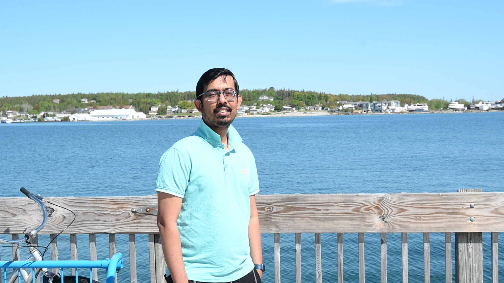

  <!-- LEFT: PHOTO -->
  

  <!-- RIGHT: TEXT -->
  

# Samik Bose

Fixed-Term Assistant Professor, Department of Computational Mathematics Science and Engineering
Michigan State University

📍 East Lansing, Michigan, US  
✉️ bosesami@msu.edu  

---

## About

I am an Assistant Professor in the Department of Computational Mathematics Science and Engineering at the Michigan State University.  
My research focuses on A, B, and C, with applications to D and E.

## Research

- **Project 1** – Short description, with key methods and results.  
- **Project 2** – Short description.  
- **Keywords:** computational chemistry, molecular dynamics, machine learning, etc.

## Publications

1. **Bose, S.**, Coauthor, “Title of the Paper”, *Journal Name*, Year.  
2. Another paper...  

[Full publication list ➜](https://scholar.google.com/) <!-- replace with your actual link -->

## Teaching

- **Course 1** – Course title, level, and term.  
- **Course 2** – Course title, level, and term.

You can find my teaching materials and syllabi on the **Teaching** page (coming soon).

## Contact

Best way to reach me: `you@university.edu`.  
You can also find me on [GitHub](https://github.com/yourusername) and [LinkedIn](https://www.linkedin.com/in/yourprofile/).
