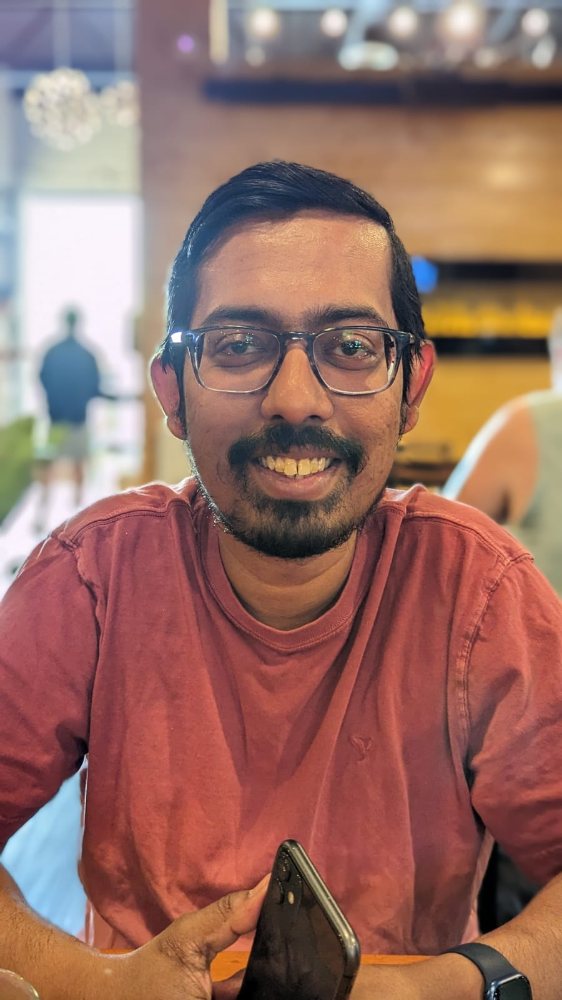

  <!-- LEFT: PHOTO -->
  

  <!-- RIGHT: TEXT -->
  

  # Samik Bose

  _Fixed-Term Assistant Professor, Department of Computational Mathematics, Science and Engineering_  
  _Michigan State University_  

  East Lansing, Michigan, US  
  ✉️ bosesami@msu.edu  

  

---

## About

I am an Assistant Professor working in the Department of Computational Mathematics Science and Engineering at the Michigan State University. I have been teaching various undergraduate and graduate level courses since joining the department e.g., Computational Medicine, Linear Algebra and Matrix Applications, Machine Learning in Molecular Dynamics and Independent Research Study coursework. 
I am also continuing my postdoctoral research under the mentorship of Prof. Alex Dickson (Biochemistry and Molecular Biology, Michigan State University) in Computational Biophysics and Pharmacology. 
In future, as an independent faculty, my goal is to combine the complementary strengths of machine learning and theoretical physical chemistry to develop computational methods for pharmacologically relevant processes, augmenting the biomedical/health research by molecular modeling. With my expertise in theoretical chemistry along with endeavors and interest in drug discovery, I hope to provide molecular bases in in solving critical problems related to 'Human Health and Biology'. Hence, I aim to collaborate and enhance the synergy between experiment and computation, utilizing facilities like cryo-EM, NMR, mass spec etc. Currently, I am collaborating actively with experimental scientists across medicinal chemistry (Prof. V. T. Karamyan, Oakland University), cryo-EM/structural biology (Dr. B. J. Orlando, Michigan State University), pharmacology (Dr. K. S. S. Lee, Michigan State University), and biochemistry/structural biology (A. A. Pioszak, University of Oklahoma Health Sciences Center). Continuous endeavors with these research groups at the interface of chemistry, biology and medicine have enlightened me about the current requirement of molecular modeling tools that will enhance the scientific community.

---

## Research

- **Keywords:** computational chemistry, molecular dynamics, machine learning, etc.

- **Project 1** – Predicting kinetics and mechanism of long timescale biomolecular processes by integrating weighted ensemble based molecular dynamics simulation.
- **Project 2** – Machine learning-driven Flexible Topology simulations to decipher chemotypes of suitable binders in proteins.

- **Project 3** - Providing a biophysical basis in ion-dependent molecular transport in transmembrane proteins.

- **Project 4** - Decoding structure and mechanism of allosteric modulators in a Zn-metallopeptidase Neurolysin.

---

## Publications

•	S.Bose, A. Aly, V. T. Karamyan, B. J. Orlando, A. Dickson, “Conformation Driven Enhancement of Neurolysin Activity in Presence of a Small Molecule Activator”. (Manuscript submitted to Biophysical Journal)

•	H. E.L. ElZorkany, H. Kandil, S. Jayaraman, S. H. Esfahani, D. Patel, D. Dannecker, M. Maciag, A. Paul, K. Lowran, S. Bose, D. A. Ostrov, C. G. Wu, A. Dickson, T. J. Abbruscato, P. C. Trippier, B. J. Orlando, V. T. Karamyan, “Discovery of a pyridine-piperazine small molecule that enhances the activity of peptidase neurolysin”. (Manuscript submitted to The Journal of Pharmacology and Experimental Therapeutics)

•	S. Bose, C. Kilinc, A. Dickson, “Markov State Models with Weighted Ensemble Simulation: How to Eliminate the Trajectory Merging Bias”, J. Chem. Theory Comput. 2025, 21, 4, 1805–1816.

•	S. Bose, S.D. Lotz, I. Deb, M.Schuck, K.S.S. Lee, A. Dickson, "How Robust is Ligand Binding Transition State", J. Am. Chem. Soc, 2023, 145, 25318-25331.

•	N. Donyapour, F.F. Niazi, N. Roussey, S Bose, A. Dickson, "Flexible Topology: A new method for dynamic drug design", J. Chem. Theory Comput., 2023, 19, 5088-5098.

•	S. Bose, S. Chakrabarty, D. Ghosh, “Support Vector Regression Based Monte Carlo Simulation of Flexible Water Clusters”, ACS Omega, 2020, 5, 7065-7073.

•	S. Bose, D. Dhawan, S. Nandi, R. R. Sarkar, D. Ghosh, “Machine Learning Prediction of Interaction Energies in Rigid Water Clusters”, Phys. Chem. Chem. Phys., 2018, 20, 22987-22996.

•	R. Chakraborty, S. Bose, D. Ghosh, “Effect of Solvation on the Ionization of Guanine Nucleotide: A Hybrid QM/EFP Study”, J. Comp. Chem., 2017, 38, 2528-2537. (Equal first authorship)

•	S. Bose, D. Ghosh, “An Interaction Energy Driven Biased Sampling Technique: A Faster Route to Ionization Spectra in Condensed Phase”, J. Comp. Chem., vol. 2017, 38, 2248-2257.

•	S. Bose, S. Chakrabarty, D. Ghosh, “Electrostatic Origin of the Red Solvatochromic Shift of DFHBDI in RNA Spinach”, J. Phys. Chem. B, 2017, 121, 4790-4798.

•	S. Bose, S. Chakrabarty, D. Ghosh, “Effect of Solvation on Electron Detachment and Excitation Energies of a Green Fluorescent Protein Chromophore Variant”, J. Phys. Chem. B, 2016, 120, 4410-4420.

[Full publication list ➜](https://www.ncbi.nlm.nih.gov/myncbi/samik.bose.1/bibliography/public/) <!-- replace with your actual link -->

---

## Teaching

- **Course 1** – Computational Medicine - Fall 2024, 400-level (graduate and undergraduate) - Lead instructor, curriculam development.  
- **Course 2** – Linear Algebra and Matrix Applications - Spring and Fall 2025 (3 sections in total).

- **Course 3** –

- **Course 4** –

---

## Contact

Best way to reach me: `bosesami@msu.edu` or `samikbose20121990@gmail.com`.  

You can also find me on [GitHub](https://github.com/SamikBose) and [LinkedIn](https://www.linkedin.com/in/samik-bose-b781b031/).
